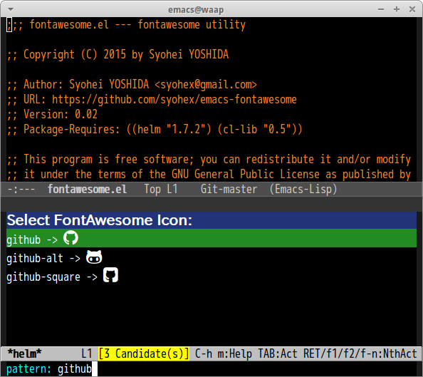

# fontawesome [![melpa badge][melpa-badge]][melpa-link] [![melpa stable badge][melpa-stable-badge]][melpa-stable-link]

Emacs [fontawesome](http://fortawesome.github.io/Font-Awesome/) utility.

## Requirements

- fontawesome font(Download from [here](http://fortawesome.github.io/Font-Awesome/))

## Installation

`fontawesome` is available on [MELPA](https://melpa.org/) and [MELPA stable](https://stable.melpa.org/)

You can install `fontawesome` with the following command.

<kbd>M-x package-install [RET] fontawesome [RET]</kbd>


## Function

#### `(fontawesome font-name)`

Return code point of `font-name`.
This function is interactive function, so you can call it by `M-x fontawesome`.

#### `M-x helm-fontawesome`

Insert fontawesome font with helm interface



#### `M-x counsel-fontawesome`

Insert fontawesome font with ivy interface

## Sample

```lisp
(insert (propertize (fontawesome "github")
        'face '(:family "FontAwesome")))

(defun insert-fontawesome ()
  (interactive)
  (insert (call-interactively 'fontawesome)))
```

[melpa-link]: https://melpa.org/#/fontawesome
[melpa-stable-link]: https://stable.melpa.org/#/fontawesome
[melpa-badge]: https://melpa.org/packages/fontawesome-badge.svg
[melpa-stable-badge]: https://stable.melpa.org/packages/fontawesome-badge.svg
